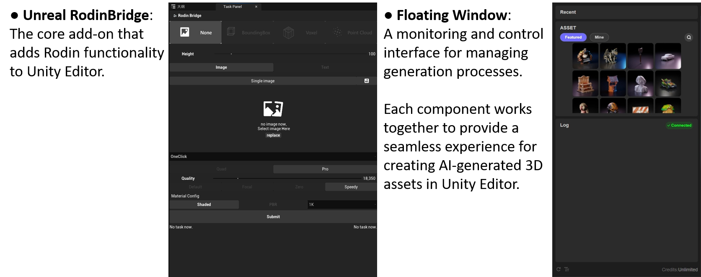
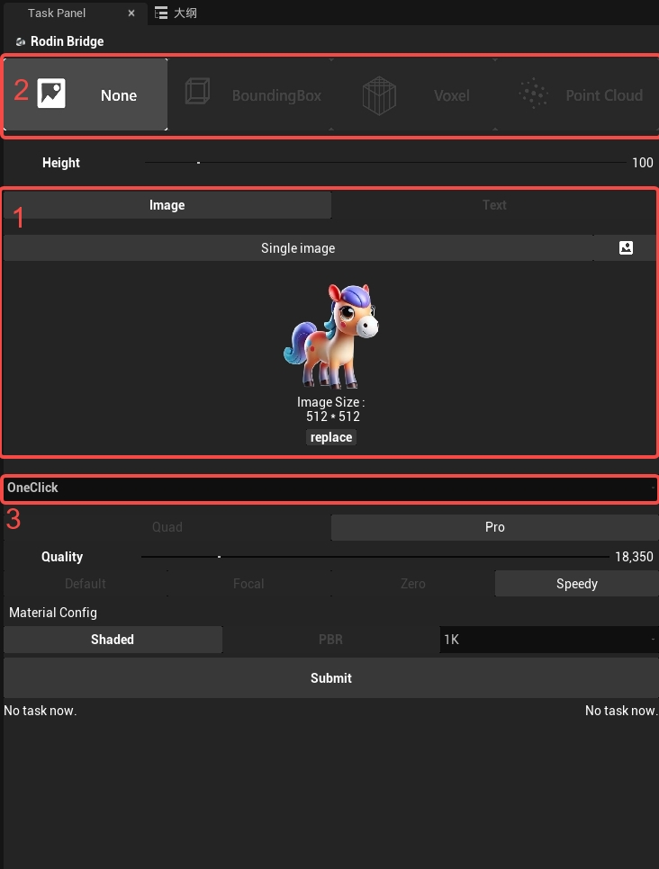
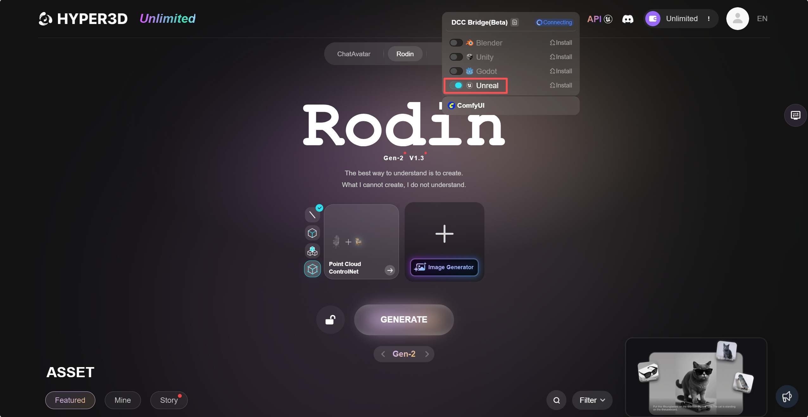
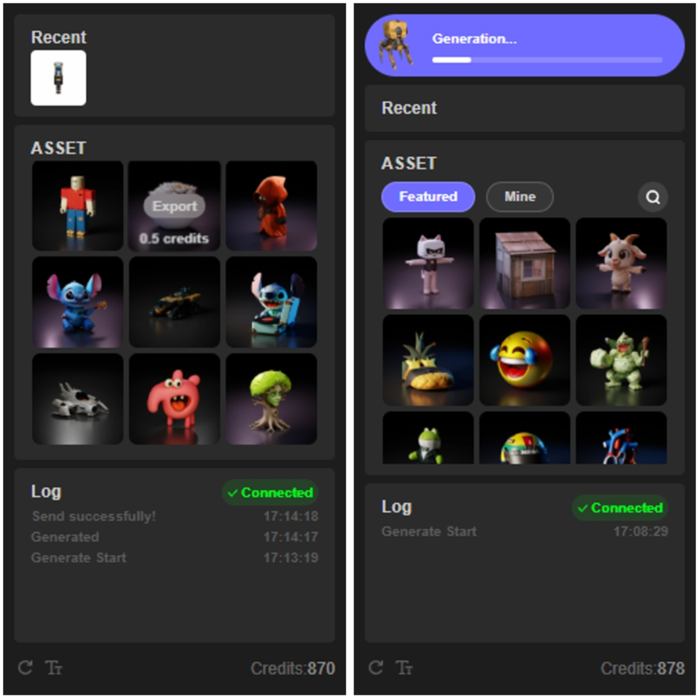
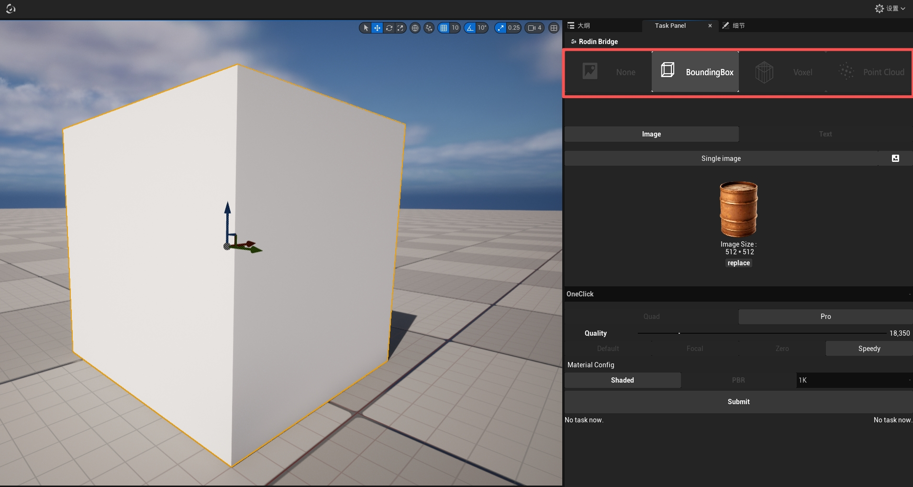
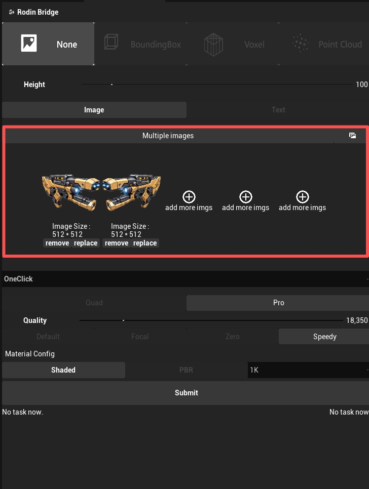
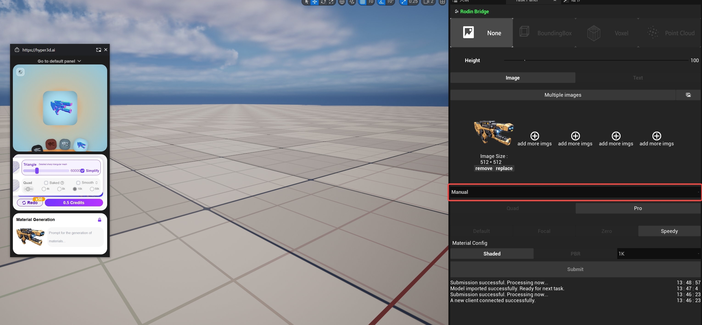

# Rodin add-on for Unreal

### Introduction

The Rodin add-on for Unreal is a powerful integration tool that supports most of the functions available on [Rodin's webpage](https://hyper3d.ai), allowing users to access image-based generation capabilities directly within the Unreal environment. It enables users to replace target images, adjust generation settings, utilize ControlNet with selected objects, and choose between automatic and manual generation modes—all while maintaining a seamless workflow between Unreal and the Rodin web interface through the convenient floating window functionality.

### Overview

The Rodin Bridge for Unreal integrates Rodin's powerful AI-based 3D generation capabilities directly into your Unreal. This integration consists of two main components:

<figure><figcaption></figcaption></figure>

### Installation

**Requirements**

Unreal Engine 5.1 (C++ project and BluePrint project) and later version (C++ project recommanded)

**Step-by-step Instruction**

1. Unzip the .zip file to any folder. The extracted folder contains the plugin named 'Rodin'.

2. Navigate to your project's root directory (where the [yourProjectName].uprojectfile is located).

3. Create a folder named 'Plugins'(if it does not exist), and place the extracted 'Rodin' folder inside it.

4. Launch Unreal Engine, open your project, and enable the plugin under ​Edit -> Plugins​​.

### Basic Usage

The Rodin add-on integrates most Rodin's generation functions directly in UnrealEngine. Operation requires interaction in both UnrealEngine and the Rodin webpage.

**Single Image Generation**

1. Click 'replace' to add/replace image you want to generate the 3D asset with.

2. Choose 'None' in ControlNet options and choose 'One Click' for the fastest generation experience. The rest of the settings are identical to those on Rodin webpage.

3. Once they are adjusted, click 'Submit' to begin the process.

<figure><figcaption></figcaption></figure>

The Rodin webpage will automatically appear if not already open. On the Rodin webpage, activate the floating window using the toggle switch.

You can monitor the generation process in the floating window. The generated asset will be automatically imported into Unreal scene.

<figure><figcaption></figcaption></figure>

You can also import featured assets or generated assets by hovering on the target asset and press the emerged 'Export' button.

<figure><figcaption></figcaption></figure>

### Advanced Functions

**ControlNet:**

To enable ControlNet, select an object in scene and choose your desired ControlNet mode. You can then adjust ControlNet settings as needed (identical to Rodin webpage settings).

<figure><figcaption></figcaption></figure>

**Multiview Mode:**

You can use 'Load Image' to add more images as the input for generation. Rodin will automatically process them as the input for multi-view generation.

<figure><figcaption></figcaption></figure>

**Generation Mode:**

You can choose between One Click mode and Manual mode.

**One Click**: Process runs without step-by-step guidance.

<figure><figcaption></figcaption></figure>

**Manual**: Requires step-by-step operation in the floating window. The process is identical to that on Rodin webpage.

<figure><figcaption></figcaption></figure>

